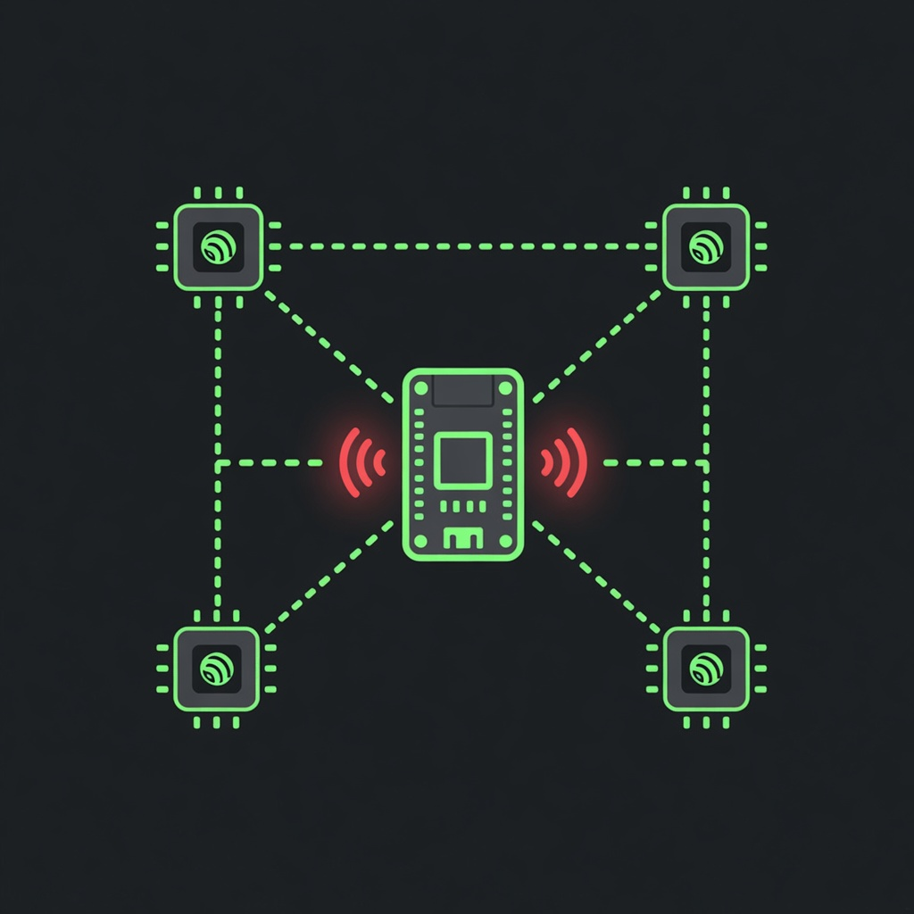
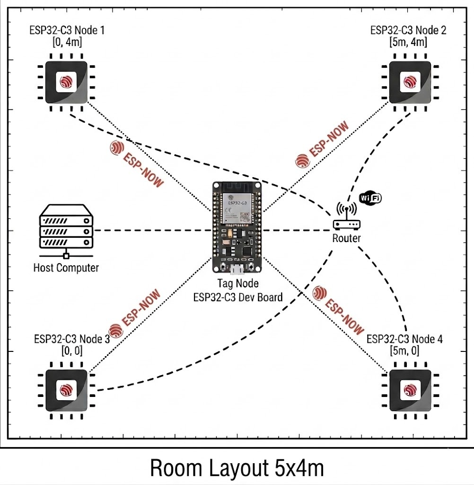
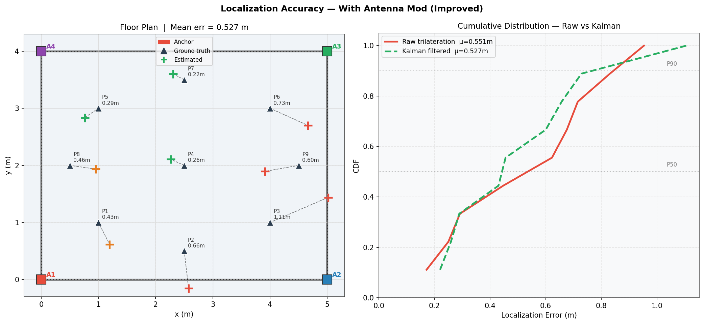

# Aura Tracker

<p align="center">
  
</p>

<p align="center">
  <b>RSSI-based indoor localization · ESP32-C3 · ESP-NOW · Live web dashboard</b>
</p>


Hello — this is my project, **Aura Tracker**.

This is one of the projects where I explore **RSSI-based indoor localization** using cheap **ESP32-C3** boards a small microcontroller that  is inexpensive and light on power so a tag or anchor can run for a long time on a small battery cell  which is why ESP32-C3 was chosen for this project. 

Aura Tracker is a **indoor positioning system**. Fixed anchors measure the received signal strength of a mobile tag over ESP-NOW, convert that into distance estimates after calibration, and a Python coordinator solves for 2D position with multilateration and a Kalman filter, then serves a live map in the browser.

I built it as a complete system you can actually run: firmware, calibration, multi-room layout editor, and live tracking it has the capability to scale with however many anchor nodes you add and each anchor node you add will directly help you improve the accuracy. 

And yes this is called Aura Tracker, also as to the fact that I couldn't really find a better name for this. As RSSI-based localization, same kind of bad .

---

## Why this is useful (and why not GPS)

**GPS fails indoors.** Satellite signals are weak or blocked by roofs, concrete, and steel. In hospitals, clinics, hostels, and similar buildings you often get no fix or a useless one.

**Aura Tracker works where GPS does not.** It uses the local 2.4 GHz radio on ESP32-C3 boards you place yourself. With calibration and three or more anchors, it can track a tag inside a room or across linked rooms at roughly **metre-level** accuracy — good enough for zone and path tracking, asset awareness, and staff/patient workflow studies, not centimetre surveying.

**Example use cases**

- **Hospitals:** track portable equipment, sample carts, or tagged staff devices within a ward without relying on outdoor GPS.  
- **Mental health institutes and care facilities:** monitor movement of authorized wearable tags within designated indoor areas for safety and workflow, while staying on a local network (no cloud required for the core pipeline).  
- **Labs and campuses:** demo indoorlocalization, multipath behaviour, and filtering .

It will not replace UWB for sub-10 cm industrial tracking, but for **cheap, low-power, self-hosted indoor presence and path tracking**, RSSI on ESP32-C3 is a practical approach.

---

## How it works



| Component | Role |
|-----------|------|
| **Tag** | Mobile ESP32-C3. Broadcasts ESP-NOW packets. Does not join the Wi-Fi AP. |
| **Anchors** | Fixed ESP32-C3s. Join Wi-Fi, measure tag RSSI, send compact UDP reports to the coordinator. |
| **Coordinator** | `coordinator/server.py` — UDP ingest, path-loss, multilateration, Kalman, Flask + Socket.IO UI. |
| **Dashboard** | Home, Map Editor, Calibration, Live Track. |

**Pipeline detail**

1. Tag transmits a packed struct (`tag_id`, counter, uptime) every `TAG_TX_INTERVAL_MS` (default 200 ms).  
2. Each anchor records RSSI (ESP-NOW receive path / promiscuous fallback), applies a sliding-window median, and UDP-sends `{anchor_id, avg_rssi, ...}` to the PC.  
3. Coordinator converts RSSI to distance with the log-distance model  
   `RSSI = A − 10·n·log10(d)`, inverted as `d = 10^((A − RSSI)/(10·n))`, using per-anchor calibrated `A` and `n`.  
4. With at least three fresh ranges, it runs **weighted nonlinear least-squares multilateration**. If a room has three or more fresh anchors, it prefers that room; otherwise it uses a global set (capped for large N).  
5. A **2D constant-velocity Kalman filter** smooths the trajectory.  
6. The browser receives `position_update` events and draws the map, trail, and RSSI cards.

**Default layout:** four corner anchors in a 5 m × 4 m room.  
**Custom layout:** multiple rooms, anchors with IDs 1–254, drag-and-drop placement with grid snap.

---

## Requirements

### Hardware

- At least **4× ESP32-C3** for a minimal demo (3 anchors + 1 tag); default design uses 4 anchors + 1 tag  
- USB power or power banks  
- Shared Wi-Fi for anchors and the coordinator PC  
- Tape measure for calibration  
- Optional: Raspberry Pi as permanent coordinator  

### Software

- [PlatformIO](https://platformio.org/)  
- Python 3.10+  
- Dependencies:

```bash
cd coordinator
pip install -r requirements.txt
```

(Flask, flask-socketio, numpy, scipy, …)

---

## Configuration you must edit

### `config.h` (Anchor and Tag — keep both in sync)

- `Anchor_Node/src/config.h`  
- `Tag_Node/src/config.h`  

```cpp
#define WIFI_SSID        "YourRealWiFiName"
#define WIFI_PASSWORD    "YourRealPassword"
#define LAPTOP_IP        "192.168.x.x"   // coordinator IPv4 on that Wi-Fi
#define LAPTOP_UDP_PORT  5005
#define ESPNOW_CHANNEL   6               // must match the AP channel
```

- Windows IP: `ipconfig` → IPv4 Address  
- Windows channel: `netsh wlan show interfaces` → Channel  

Anchors remain on the **AP channel** so UDP stays alive. The tag must use the **same** channel via `ESPNOW_CHANNEL`. A mismatch is the most common reason ESP-NOW “does nothing.”

### Flashing IDs

Each anchor needs a unique `ANCHOR_ID` (1–254).

```bash
# Anchor_Node/
pio run -e anchor1 -t upload       # normal
pio run -e anchor1_cal -t upload   # calibration mode
pio run -e anchor2 -t upload
# ...

# Tag_Node/
pio run -e tag -t upload
```

Generic envs `anchor` / `anchor_cal` exist if you set `ANCHOR_ID` in `platformio.ini`.

---

## Setup procedure

### 1. Install coordinator deps

```bash
cd coordinator
pip install -r requirements.txt
```

### 2. Configure and flash

1. Fill both `config.h` files.  
2. Measure anchor positions.  
3. Flash tag and anchors (use `*_cal` when calibrating).  

### 3. Start the server

```bash
cd coordinator
python server.py
```

Open **http://localhost:8080** (or `http://<host-ip>:8080` on LAN).

### 4. Layout

On **Home**, choose **Default layout** (4 corners, 5×4 m) or **Custom layout**.  
Use **Map Editor** to add rooms/anchors and place them:


Changes persist in `coordinator/site_config.json`.

### 5. Calibration

Calibrate each anchor at its final mount position. Prefer `anchorN_cal` firmware so samples arrive every tag packet.


Physical checklist: tape marks every **1 m** from 1 m outward, clear LOS, same height, vertical antenna.

Wizard flow: start session → collect at each distance → commit → fit A and n → reflash **normal** mode.

CLI alternative:

```bash
cd coordinator
python calibration.py --anchor 1
```

Without calibration data, the UI warns that status cannot be shown properly and that live tracking will not work correctly.

### 6. Live tracking

Power tag + normal-mode anchors, open **Live Track**. Expect position, RSSI cards, distance rings, and fix mode **ROOM** or **GLOBAL**.

---

## Dashboard

| Tab | Purpose |
|-----|---------|
| **Home** | Default vs custom layout |
| **Map Editor** | Rooms, anchors, snap placement, zoom/pan |
| **Calibration** | Path-loss A, n per anchor |
| **Live Track** | Real-time position and diagnostics |

### Day-to-day

1. Power anchors and tag  
2. `python coordinator/server.py`  
3. Live Track in the browser  

### Adding an anchor later

Flash unique ID → Map Editor → calibrate → track when reports are fresh.

### Multi-room

Define rooms and assign anchors in global metres. Room-local fix if that room has ≥3 fresh anchors; otherwise global multilateration.

---

## Important files

| File | Role |
|------|------|
| `Anchor_Node/src/config.h` | Wi-Fi, coordinator IP, ESP-NOW channel |
| `Tag_Node/src/config.h` | Same channel/settings for the tag |
| `coordinator/site_config.json` | Layout: rooms, anchors, snap, A/n |
| `coordinator/calibration_results.json` | Calibration fits |
| `coordinator/server.py` | Dashboard and localization runtime |

---

## Results



*Ground truth vs estimated points on the floor plan, plus raw vs Kalman error CDF (antenna-mod run).*

---

## Accuracy

With careful calibration and line-of-sight, mean error on the order of **~0.5–1.5 m** in a small room is realistic.   Body blocking, and antenna orientation dominate residual error. Kalman improves temporal smoothness; it does not invent true geometry.

---

## Flash / run reference

```bash
# Tag
cd Tag_Node
pio run -e tag -t upload

# Anchors
cd ../Anchor_Node
pio run -e anchor1 -t upload
pio run -e anchor1_cal -t upload

# Coordinator
cd ../coordinator
python server.py
```

Serial: 115200 baud.
